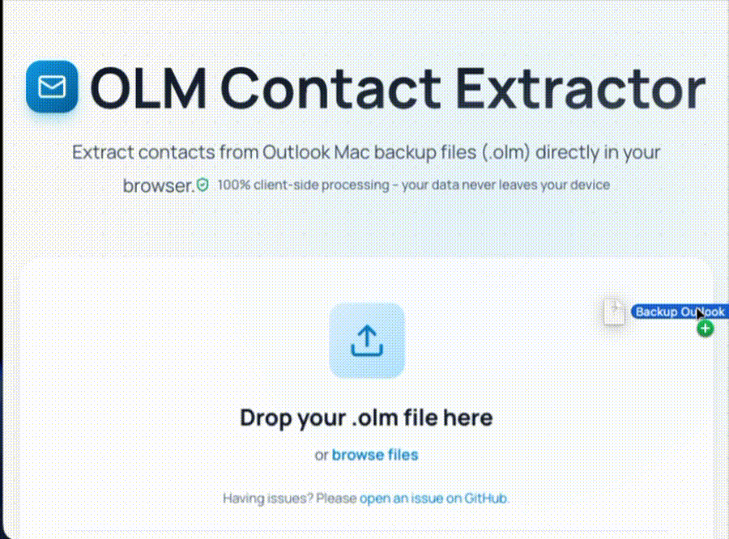

# Outlook Contacts Exporter

Extract contacts from Outlook for Mac backup files (`.olm`) and download them as CSV or vCard. Includes a CLI tool and a simple web UI.



## Features
- Works entirely offline (client-side for the web UI)
- Exports CSV and vCard (`.vcf`)
- Finds frequent contacts
- Supports sent-message parsing (optional)

## Quick Start (CLI)
```bash
npm install
unzip backup.olm -d olm_extracted
npm run extract ./olm_extracted ./output
```

Outputs in `./output/`:
- `contacts.csv`
- `contacts-frequent.csv`
- `contacts.vcf`

## Quick Start (Web UI)
```bash
cd web
npm install
npm run dev
```
Open `http://localhost:5173/` and upload a `.olm` file.
See `web/README.md` for web-specific notes.

## Export an OLM File (Outlook for Mac)
1. Open Outlook and select your mailbox.
2. Go to File → Export.
3. Choose “Outlook for Mac Data File (.olm)” and Continue.
4. Select what to export and Continue.
5. Save the file, then upload or extract it.

Note: Windows Outlook exports `.pst`, which is not supported.

## Privacy
All processing happens locally on your machine. Your files are not uploaded anywhere.

## Contributing
See `AGENTS.md` for repository guidelines and common commands.

## License
MIT. See `LICENSE`.
